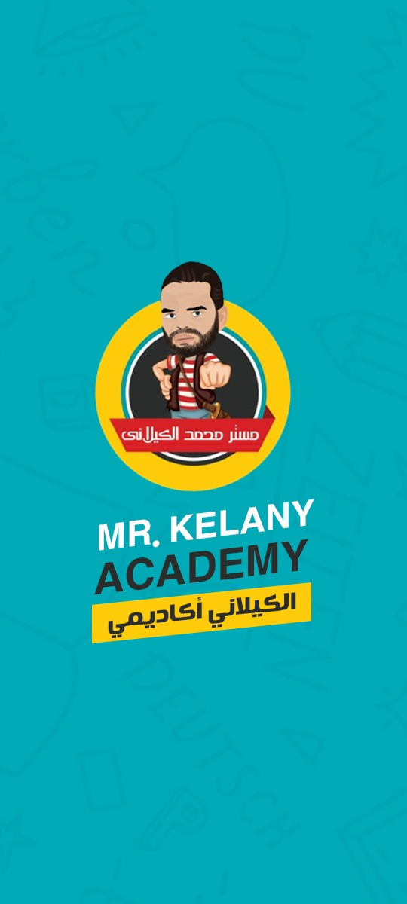
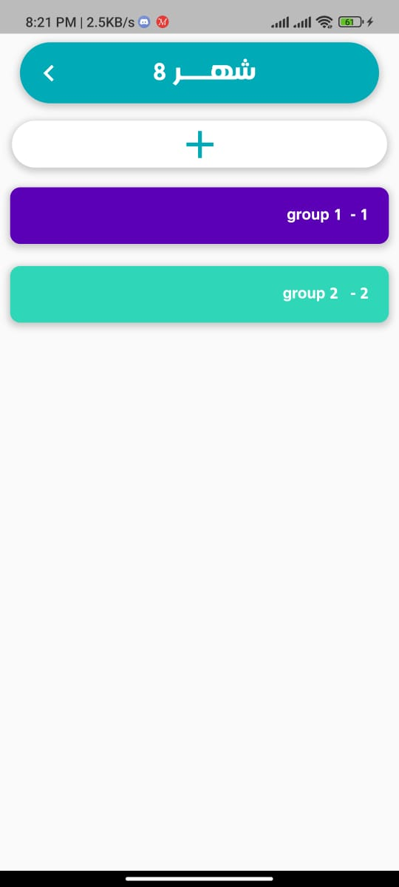
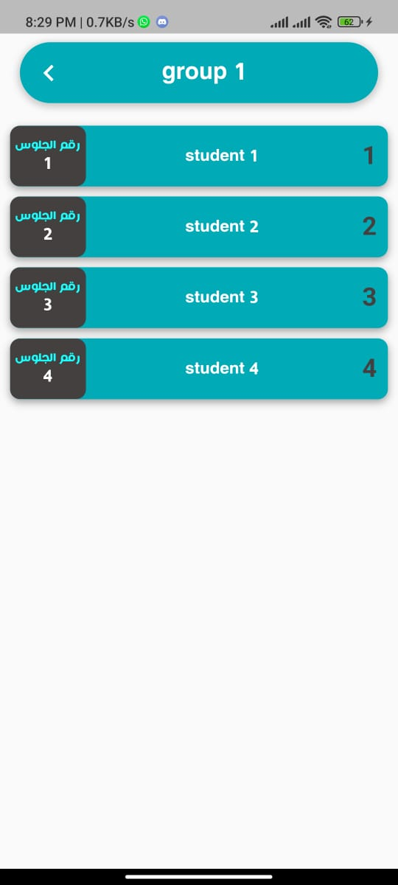

<!-- PROJECT LOGO -->
 

  

  <h3 align="center">Alkeleny Academy</h3>

  

  A powerful Flutter application revolutionizing the management of private lessons.
  

<!-- ABOUT THE PROJECT -->
## About The Project
The Alkeleny Academy Management App is designed to provide a comprehensive set of features, including real-time student monitoring, secure monthly payment tracking, efficient grade recording, and detailed report generation. Leveraging the capabilities of Firebase, the app integrates a secure and scalable backend for data storage and user authentication.

GetX is employed for state management, guaranteeing a smooth and responsive user interface, thereby enhancing the overall user experience.

## Features

- **Student Monitoring**: Keep track of students' progress and performance.
- **Payment System**: Facilitate monthly payments and provide payment history.
- **Grade Recording**: Record and manage student grades efficiently.
- **Report Generation**: Generate and share reports for students.
- **Group Management**: Create, delete, and move students between groups.

### Built With
- flutter
- firebase
- getx state management

<!-- USAGE EXAMPLES -->
## photos

 

  

 
 
  
  
  
  
   
    
  

## Video

 

<video width="630" height="300" src="https://github.com/kareem-Abed/Alkeleny-Academy/assets/130121946/089a2aff-501a-4a4b-a00c-70d03d9d6d14"></video>

<!-- CONTACT -->
## Contact

 

 

    

